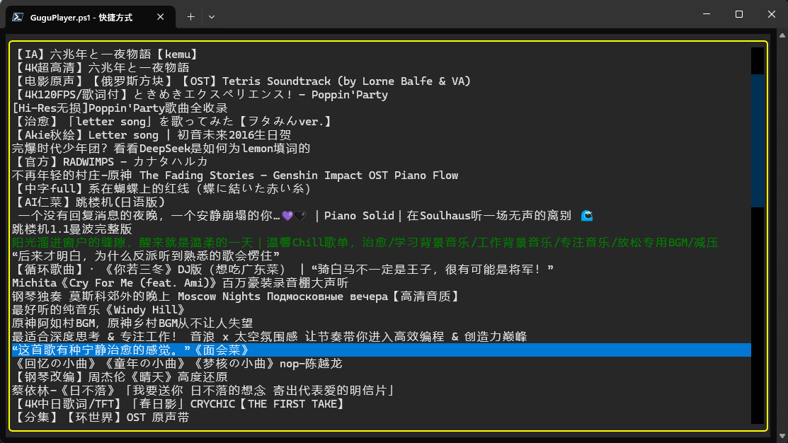

# Gugu Player 咕咕播放器

B站音频播放器。是一个跨平台的、TUI界面的b站音频播放器，聚焦于播放 Bilibili 视频中的音频内容。目前使用Python编写，采用ffmpeg/ffplayer作为后端，以GPL协议开源。

有基本的播放器控制功能，可以加载播放列表或从b站收藏夹中读取音乐。



## 功能

- [x] 播放流式音频
- [x] 播放b站视频的音频
- [x] 加载json播放列表
- [x] 播放器显示音乐列表
- [x] 播放器切换音乐
- [x] 制作基本TUI界面
- [x] 显示基本的播放信息
- [ ] 支持在分p视频中选集
- [ ] 播放控制（自动连播、单曲循环）
- [ ] 支持音量调节
- [ ] 支持播放进度条
- [ ] 支持随机播放和循环播放
- [x] 支持快捷键操作
- [ ] 支持导入/导出播放列表
- [ ] 支持与b站收藏夹同步
- [ ] 支持搜索和筛选音乐

## 使用方法

在依赖齐全的环境中执行 `python PlayerFrontend.py playlist.json`打开播放器界面。播放器界面只有一个列表，显示playlist中的每个标题。

- 上下箭头或鼠标点击选中视频音乐，按空格键开始播放当前选中的视频音乐、
- 在音乐播放中按空格可以暂停/继续播放当前正在播放的视频音乐。
- 按enter，立即停止播放当前正在播放的视频音乐，并立即开始播放现在选中的视频音乐。
- 按q，立即停止任何播放的音乐。
- 按ctrl+q，退出播放器。
- 当前正在播放的列表项显示为绿色、已暂停播放的项目显示为红色，若当前没有正在播放的音频，所有项目都是默认颜色。
- 软件会在运行路径下生成文件 ffpyplayer.log，这个文件是ffplayer播放器的日志。

## 安装方法

在安装之前，首先需要安装ffmpeg。

### Windows用户安装ffmpeg

1. 访问 [ffmpeg官网](https://ffmpeg.org/download.html) 或 [Gyan.dev下载页](https://www.gyan.dev/ffmpeg/builds/)。
2. 下载最新的 Windows 版本压缩包（通常为 `.zip` 文件）。
3. 解压缩到任意目录，例如 `C:\ffmpeg`。
4. 将 `C:\ffmpeg\bin` 添加到系统环境变量 `Path` 中：
    - 打开“控制面板” → “系统” → “高级系统设置” → “环境变量”。
    - 在“系统变量”中找到 `Path`，点击“编辑”，添加 `C:\ffmpeg\bin`。
5. 打开命令行，输入 `ffmpeg -version` 检查是否安装成功。

> 注意：`ffmpeg` 或 `ffplayer` 必须添加到环境变量，否则播放器无法正常工作。

### 使用venv安装

1. 确保已安装 Python 3.12 及以上版本。
2. 在项目根目录下打开命令行，执行以下命令创建虚拟环境：
    ```bash
    python -m venv venv
    ```
3. 激活虚拟环境：
    - Windows:
      ```bash
      .\venv\Scripts\activate
      ```
    - macOS/Linux:
      ```bash
      source venv/bin/activate
      ```
4. 安装依赖：
    ```bash
    pip install -r requirements.txt
    ```
5. 启动播放器：
    ```bash
    python PlayerFrontend.py
    ```